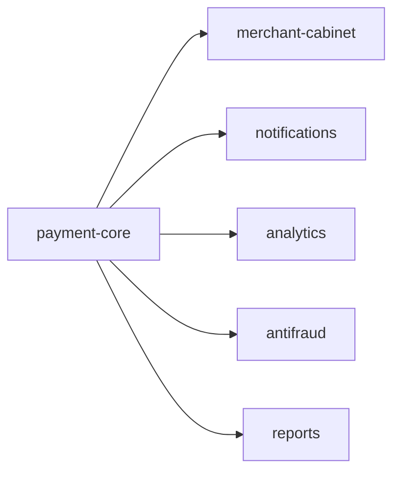
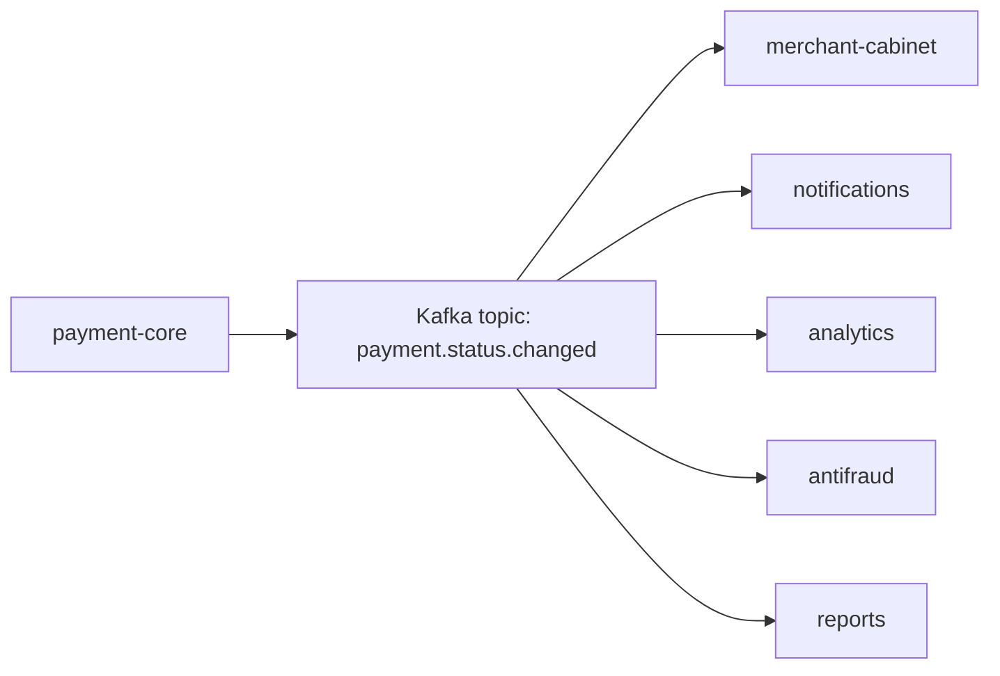
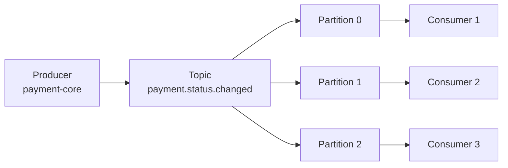
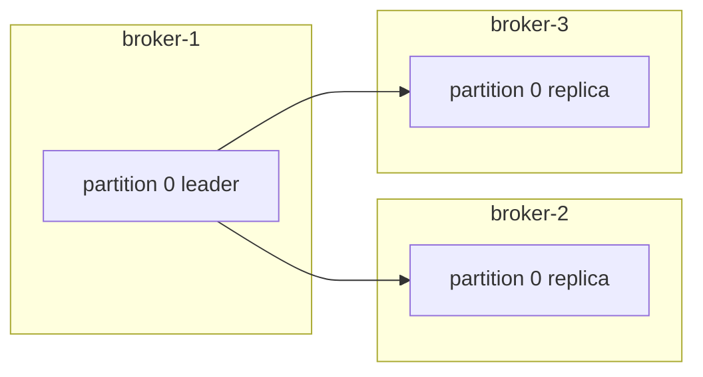
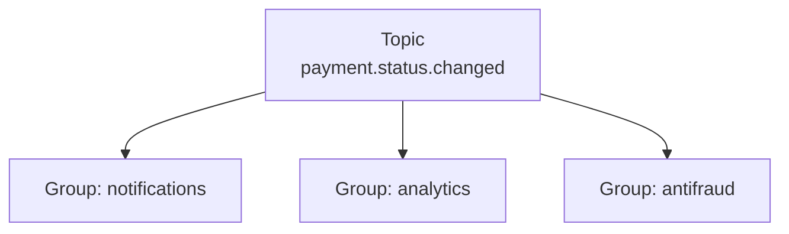
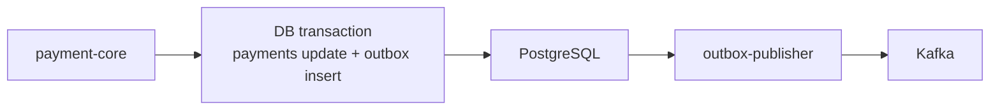
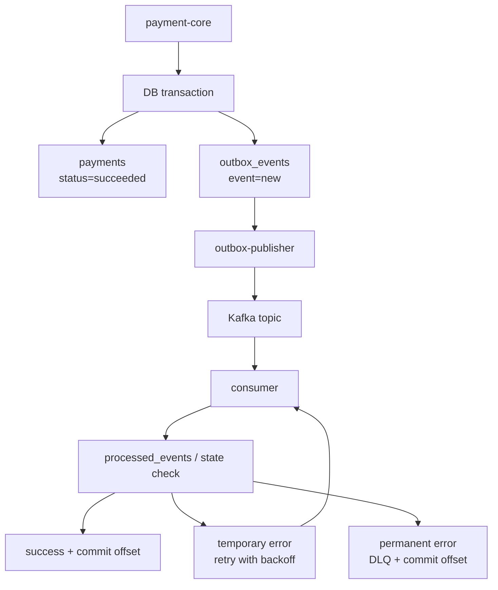

---
lk:
  source_role: primary_source_artifact
  source_refs:
    - "Apache Kafka documentation: Intro, design, producer configs, consumer configs"
    - "Confluent documentation: Kafka topics, partitions, consumer groups, delivery semantics"
    - "Martin Kleppmann, Designing Data-Intensive Applications: logs, replication, partitioning, stream processing, reliability"
    - "Gregor Hohpe and Bobby Woolf, Enterprise Integration Patterns: Idempotent Receiver, Dead Letter Channel"
    - "Chris Richardson, Microservices Patterns: Transactional Outbox and Idempotent Consumer"
  prompt_helper: |
    Проверять базовое понимание Kafka через механики: topic, partition, producer key,
    consumer group, offset, rebalance, lag, replication, retention, ordering,
    at-least-once, outbox, idempotent consumer, retry with backoff и DLQ.
  challenge_helper: |
    Давай мини-кейс платежного контура: payment-core публикует payment.status.changed,
    downstream consumer-ы читают события, один consumer падает до commit offset,
    внешний сервис временно недоступен, одно сообщение битое. Проси объяснить
    partition key, offset commit, retry/DLQ, outbox и защиту от дублей.
---

# Kafka

Kafka - это распределенный журнал событий.

На бытовом языке: сервисы складывают в Kafka факты о том, что произошло, а другие сервисы читают эти факты в своем темпе.

Например в платежном контуре:

```text
payment-core: "платеж pay_123 стал succeeded"
```

Это событие могут прочитать разные системы:

```text
уведомления
личный кабинет мерчанта
аналитика
антифрод
отчетность
```

Главная мысль:

> Kafka нужна не просто как "очередь". Kafka нужна как durable event log, который развязывает сервисы, сглаживает пики нагрузки и позволяет нескольким независимым consumer groups читать один и тот же поток событий.

## Зачем Kafka нужна

Без брокера `payment-core` должен дергать всех напрямую:



Минусы:

- `payment-core` знает обо всех downstream-сервисах;
- если один downstream тормозит, основной платежный flow может страдать;
- при добавлении нового потребителя нужно менять producer-сервис;
- пики callback-ов сложно сглаживать;
- разбор повторов и временных ошибок расползается по HTTP-вызовам.

С Kafka `payment-core` публикует событие один раз:



Теперь основной сервис говорит:

```text
Я зафиксировал факт: статус платежа изменился.
```

А downstream-сервисы сами решают, как и когда этот факт обработать.

## Базовая модель

В Kafka есть несколько ключевых сущностей:

```text
producer        пишет события
broker          сервер Kafka, который хранит события
topic           логическая категория событий
partition       физический кусок topic-а и упорядоченный журнал
consumer        читает события
consumer group  группа consumer-ов одного назначения
offset          позиция сообщения внутри partition
replication     копирование partition между broker-ами
retention        правило, как долго хранить события
```

Упрощенная схема:



## Event

Kafka обычно хранит не команду "сделай что-то", а событие "что-то произошло".

Например:

```json
{
  "event_id": "evt_001",
  "event_type": "payment.status.changed",
  "operation_id": "pay_123",
  "merchant_id": "m_10",
  "old_status": "processing",
  "new_status": "succeeded",
  "amount": 1000,
  "currency": "RUB",
  "occurred_at": "2026-07-22T12:00:00Z",
  "schema_version": 1
}
```

Хорошее событие обычно содержит:

- уникальный `event_id`;
- тип события;
- бизнес-идентификатор, например `operation_id`;
- данные, достаточные consumer-у для обработки;
- время события;
- версию схемы;
- correlation/request id для трассировки.

## Topic

Topic - это логическая категория событий.

Примеры:

```text
payment.created
payment.status.changed
provider.callback.received
refund.created
```

Topic не удаляет сообщение сразу после чтения. Kafka хранит события по retention policy:

```text
хранить 7 дней
или хранить до 100 GB
или хранить компактированную последнюю версию по ключу
```

Это важное отличие от классической очереди:

> В Kafka событие не исчезает просто потому, что один consumer его прочитал. Разные consumer groups могут читать один и тот же topic независимо.

## Partition

Topic делится на partitions.

```text
payment.status.changed
  partition 0
  partition 1
  partition 2
```

Partition - это упорядоченный append-only log:

```text
partition 0:
  offset 0 -> event A
  offset 1 -> event B
  offset 2 -> event C
```

Kafka гарантирует порядок только внутри одной partition.

Если два события лежат в одной partition:

```text
offset 10 -> pay_123 processing
offset 11 -> pay_123 succeeded
```

то consumer прочитает их в этом порядке.

Но между разными partitions глобального порядка нет:

```text
partition 0: offset 10 -> event A
partition 1: offset 20 -> event B
```

Kafka не обещает, что все consumer-ы увидят общий порядок `A` и `B`.

## Зачем нужны partitions

Partitions нужны по трем причинам.

Первая причина - параллелизм.

Если topic состоит из одной partition, внутри одной consumer group активно читать ее может только один consumer:

```text
partition 0 -> consumer 1
consumer 2 -> idle
consumer 3 -> idle
```

Если partitions три:

```text
partition 0 -> consumer 1
partition 1 -> consumer 2
partition 2 -> consumer 3
```

Теперь обработка идет параллельно.

Вторая причина - масштабирование хранения и нагрузки.

Partitions можно разложить по разным broker-ам:

```text
partition 0 -> broker 1
partition 1 -> broker 2
partition 2 -> broker 3
```

Так Kafka распределяет запись, чтение и хранение.

Третья причина - порядок по ключу.

Если все события одного платежа отправлять с одинаковым ключом:

```text
key = operation_id
```

то они попадут в одну partition:

```text
partition 1:
  pay_123 created
  pay_123 processing
  pay_123 succeeded
```

И порядок по одному платежу сохранится.

Короткая аналогия:

```text
одна partition = одна касса
несколько partitions = несколько касс
```

Несколько касс быстрее, но общий порядок всех покупателей между кассами не сохраняется. Порядок сохраняется только внутри конкретной кассы.

## Producer

Producer - это сервис, который пишет сообщения в Kafka.

Например:

```text
payment-core обновил статус платежа
payment-core публикует payment.status.changed
```

Producer указывает:

```text
topic
key
value/payload
headers
```

Пример:

```text
topic = payment.status.changed
key   = pay_123
value = {"event_id":"evt_001","new_status":"succeeded"}
```

## Как producer выбирает partition

Producer пишет в topic, а Kafka client выбирает partition.

Есть три базовых варианта.

### Вариант 1. У сообщения есть key

Если задан key, producer обычно считает hash от ключа:

```text
partition = hash(key) % number_of_partitions
```

Например:

```text
hash("pay_123") % 3 = 1
```

Значит сообщение уйдет в `partition 1`.

Схема:

```text
pay_123 -> hash -> partition 1
pay_456 -> hash -> partition 0
pay_789 -> hash -> partition 2
```

Главное следствие:

> Одинаковый key обычно попадает в одну и ту же partition.

Поэтому для платежных статусов хороший ключ:

```text
key = operation_id
```

Так все события одного платежа идут в одну partition и сохраняют порядок.

### Вариант 2. Key нет

Если key нет, producer распределяет сообщения между partitions сам: равномерно, батчами или по своей стратегии клиента.

Это хорошо для throughput, но плохо для порядка по конкретной сущности.

Пример:

```text
event A -> partition 0
event B -> partition 1
event C -> partition 2
```

Если `event A` и `event B` относятся к одному платежу, порядок может стать неочевидным.

### Вариант 3. Partition указали вручную

Можно явно сказать:

```text
send to partition 2
```

В обычной бизнес-логике так почти не делают, потому что код начинает зависеть от физического устройства topic-а.

На собеседовании:

> Если мне важен порядок событий по сущности, я выбираю partition key по этой сущности: `operation_id`, `order_id`, `user_id`. Если порядок не важен, можно отправлять без key и дать producer-у балансировать нагрузку.

## Broker и replication

Kafka cluster состоит из broker-ов:

```text
broker-1
broker-2
broker-3
```

Partition обычно имеет leader и replicas:



Producer пишет в leader. Replicas копируют данные.

Если broker с leader упал, Kafka может выбрать нового leader из актуальных replicas.

Важные producer-настройки для надежности:

```text
acks=all
retries включены
enable.idempotence=true
```

`acks=all` означает: producer считает запись успешной, когда leader получил подтверждение от нужного числа replicas.

`enable.idempotence=true` помогает producer-у не записать дубликат из-за внутренних retry producer-а.

Но важная граница:

> Idempotent producer Kafka не делает весь бизнес-процесс exactly-once. Если consumer вызвал внешний API и упал до commit offset, бизнес-side-effect все равно может повториться. Поэтому нужны идемпотентные consumer-ы и бизнесовые ключи.

## Consumer

Consumer - это сервис, который читает события.

Например:

```text
notification-service читает payment.status.changed
если статус succeeded, отправляет уведомление
```

Consumer читает сообщения по offset-ам:

```text
partition 0:
  offset 0 -> event A
  offset 1 -> event B
  offset 2 -> event C
```

Offset - это позиция внутри partition.

Consumer после обработки фиксирует:

```text
Я обработал до offset N.
```

Это называется commit offset.

## Consumer group

Consumer group - это группа consumer-ов одного назначения.

Например, сервис уведомлений запущен в трех экземплярах:

```text
notification-1
notification-2
notification-3
```

Все они входят в одну group:

```text
group_id = notification-service
```

Kafka назначает partitions consumer-ам:

```text
partition 0 -> notification-1
partition 1 -> notification-2
partition 2 -> notification-3
```

Внутри одной consumer group одна partition в один момент времени читается только одним consumer-ом.

Это правило дает порядок внутри partition и понятное масштабирование.

## Как consumer понимает, из какой partition читать

Обычно consumer не выбирает partition вручную.

Он говорит Kafka:

```text
Я consumer из group notification-service.
Я подписан на topic payment.status.changed.
```

Group coordinator внутри Kafka делает assignment:

```text
consumer-1 читает partitions 0 и 2
consumer-2 читает partition 1
```

Если consumer-ов меньше, чем partitions:

```text
3 partitions
2 consumers
```

один consumer получит больше одной partition:

```text
partition 0 -> consumer 1
partition 1 -> consumer 2
partition 2 -> consumer 1
```

Если consumer-ов больше, чем partitions:

```text
3 partitions
5 consumers
```

лишние consumer-ы будут idle:

```text
partition 0 -> consumer 1
partition 1 -> consumer 2
partition 2 -> consumer 3
consumer 4 -> idle
consumer 5 -> idle
```

## Несколько consumer groups

Одно сообщение может быть прочитано разными consumer groups независимо.



Каждая group имеет свои offset-ы.

Это значит:

```text
notifications могут быть на offset 1000
analytics могут быть на offset 700
antifraud могут быть на offset 990
```

Они не мешают друг другу.

## Rebalance

Rebalance - это перераспределение partitions между consumer-ами в group.

Он происходит, например, когда:

- добавили новый consumer;
- consumer умер;
- consumer слишком долго не присылал heartbeat;
- изменился набор partitions;
- изменился список подписанных topics.

Пример:

```text
было:
partition 0 -> consumer 1
partition 1 -> consumer 2

consumer 2 упал

стало:
partition 0 -> consumer 1
partition 1 -> consumer 1
```

Во время rebalance обработка может кратко остановиться или замедлиться.

Consumer должен быть готов, что после rebalance он получит partition и начнет читать с последнего committed offset.

## Offset commit

Offset commit - это запись позиции, до которой consumer group обработала partition.

Ключевое правило:

> Commit offset нужно делать после успешной обработки сообщения или после controlled skip, когда сообщение сознательно отправлено в DLQ.

Опасный вариант:

```text
1. Consumer получил сообщение.
2. Сразу commit offset.
3. Начал обработку.
4. Упал.
```

Сообщение потеряно для этой group: offset уже сдвинут, а обработка не выполнена.

Нормальный вариант:

```text
1. Consumer получил сообщение.
2. Обработал сообщение.
3. Зафиксировал результат.
4. Commit offset.
```

Если consumer упал до commit, Kafka отдаст сообщение повторно.

Поэтому нужна идемпотентность consumer-а.

## Delivery semantics

На практике в Kafka чаще всего проектируют под `at-least-once`.

### At-most-once

```text
Сообщение может быть потеряно, но не будет обработано повторно.
```

Так получается, если commit offset сделать до обработки.

Для платежных событий обычно плохо.

### At-least-once

```text
Сообщение не теряем, но оно может прийти повторно.
```

Это самый частый практический режим:

```text
обработал -> commit offset
упал до commit -> получишь сообщение еще раз
```

Плюс:

```text
событие не теряем
```

Минус:

```text
нужны идемпотентные consumer-ы
```

### Exactly-once

Kafka умеет транзакционные механизмы для некоторых сценариев Kafka-to-Kafka processing.

Но для backend-разработчика важно не переобещать:

> Exactly-once внутри Kafka не означает exactly-once для внешнего мира. Если consumer пишет в PostgreSQL, отправляет SMS или дергает платежного провайдера, нужны отдельные бизнесовые гарантии: unique constraint, idempotency key, processed_events, state machine, reconciliation.

## Lag

Lag - это сколько сообщений Kafka уже получила, но consumer group еще не обработала.

```text
latest offset = 10000
committed offset = 8500
lag = 1500
```

Если lag растет постоянно, consumer-ы не успевают.

Возможные причины:

- мало consumer-ов;
- мало partitions для нужного параллелизма;
- обработка одного сообщения слишком тяжелая;
- медленная база;
- внешний HTTP-сервис тормозит;
- частые retry;
- неудачный partition key создал перекос нагрузки.

## Сколько нужно consumer-ов и partitions

Главное правило:

```text
максимальный параллелизм consumer group = количество partitions
```

Если у topic 6 partitions, то внутри одной group может активно читать максимум 6 consumer-ов.

```text
6 partitions -> максимум 6 active consumers
```

Седьмой consumer не даст прироста, он будет idle.

Если partitions больше, чем consumer-ов:

```text
12 partitions
3 consumers
```

каждый consumer будет читать несколько partitions.

Упрощенная формула:

```text
нужно consumer-ов = incoming_messages_per_second / messages_per_second_per_consumer
```

Например:

```text
приходит 1000 сообщений/сек
один consumer обрабатывает 250 сообщений/сек
```

Значит нужно примерно:

```text
1000 / 250 = 4 consumer-а
```

Но topic должен иметь минимум 4 partitions.

На практике учитывают:

- текущий throughput;
- пиковый throughput;
- скорость обработки одного consumer-а;
- допустимый lag;
- требования к порядку;
- нагрузку на broker-ы;
- запас на рост;
- стоимость rebalance и эксплуатации.

Не нужно делать partitions "на всякий случай" бесконечно много. Partition - это не бесплатная сущность: у нее есть файлы, metadata, leader, replicas, offset-ы и нагрузка на cluster.

Хорошая практическая мысль:

> Partitions задают потолок будущего параллелизма, а consumer-ы добавляют по фактической нагрузке и lag.

## Пример платежного topic-а

Предположим:

```text
topic = payment.status.changed
partitions = 12
key = operation_id
```

Почему key именно `operation_id`:

- события одного платежа попадут в одну partition;
- порядок статусов одного платежа сохранится;
- разные платежи будут распределены по partitions;
- consumer group сможет обрабатывать разные платежи параллельно.

Пример:

```text
partition 1:
  pay_123 created
  pay_123 processing
  pay_123 succeeded

partition 4:
  pay_555 created
  pay_555 failed
```

## Надежная публикация: проблема DB + Kafka

Kafka надежно хранит событие после успешной записи.

Но в бизнес-сервисе часто есть две системы:

```text
PostgreSQL
Kafka
```

Например `payment-core` должен:

```text
1. Обновить платеж в PostgreSQL: processing -> succeeded.
2. Опубликовать событие в Kafka: payment.status.changed.
```

Наивный вариант:

```text
UPDATE payments
publish to Kafka
```

Проблема:

```text
UPDATE прошел
сервис упал до publish
```

Итог:

```text
в БД платеж succeeded
в Kafka события нет
downstream-сервисы не узнали об успехе
```

Обратный порядок тоже плох:

```text
publish to Kafka
UPDATE payments
```

Если publish прошел, а транзакция в БД откатилась, consumer-ы увидят событие о платеже, которого по факту нет.

## Transactional Outbox

Transactional outbox решает связку:

```text
изменить бизнес-данные + надежно опубликовать событие
```

Идея:

> Сначала событие сохраняется в той же базе и в той же транзакции, что и бизнес-изменение. Потом отдельный publisher отправляет outbox-события в Kafka.

Пример:

```sql
BEGIN;

UPDATE payments
SET status = 'succeeded'
WHERE id = 'pay_123';

INSERT INTO outbox_events (
    event_id,
    topic,
    message_key,
    payload,
    status,
    created_at
) VALUES (
    'evt_001',
    'payment.status.changed',
    'pay_123',
    '{"operation_id":"pay_123","new_status":"succeeded"}',
    'new',
    now()
);

COMMIT;
```

Теперь гарантируется:

```text
если payment status изменился, outbox event тоже сохранен;
если транзакция откатилась, нет ни изменения, ни события.
```

Дальше работает publisher:

```text
1. Найти outbox_events со status = new.
2. Отправить событие в Kafka.
3. Пометить событие как sent.
```

Схема:



Важный нюанс:

> Outbox обычно дает at-least-once publication. Событие может быть опубликовано повторно.

Например:

```text
publisher отправил событие в Kafka
publisher упал до mark as sent
после рестарта publisher снова отправил это событие
```

Поэтому consumer-ы должны быть идемпотентными.

## Idempotent Consumer

Consumer в Kafka должен быть готов к дубликатам.

Причины дублей:

- publisher отправил outbox event повторно;
- consumer обработал сообщение, но упал до commit offset;
- произошел rebalance;
- producer retry при неправильных настройках;
- событие пришло повторно из внешней системы.

Пример проблемы:

```text
notification-service получил payment.succeeded
отправил SMS
упал до commit offset
после рестарта снова получил payment.succeeded
снова отправил SMS
```

Idempotent consumer означает:

> Повторная обработка одного и того же события не должна создавать повторный опасный side effect.

Обычно в событии есть `event_id`.

Consumer хранит таблицу:

```sql
CREATE TABLE processed_events (
    consumer_name text NOT NULL,
    event_id text NOT NULL,
    processed_at timestamptz NOT NULL DEFAULT now(),
    PRIMARY KEY (consumer_name, event_id)
);
```

Флоу:

```text
1. Получил event evt_001.
2. Пытаюсь вставить (consumer_name, event_id) в processed_events.
3. Если insert успешен, обрабатываю событие.
4. Если duplicate key, значит этот consumer уже обработал событие.
5. Commit offset.
```

Для consumer-а, который пишет в свою БД, dedup и бизнес-изменение лучше делать в одной транзакции:

```sql
BEGIN;

INSERT INTO processed_events (consumer_name, event_id)
VALUES ('billing-projection', 'evt_001');

UPDATE merchant_balances
SET paid_amount = paid_amount + 1000
WHERE merchant_id = 'm_10';

COMMIT;
```

Если `INSERT processed_events` получил duplicate key, значит сообщение уже обработано, и второй раз увеличивать сумму нельзя.

Для платежей часто добавляют еще state machine:

```text
processing -> succeeded  ok
succeeded -> succeeded   duplicate, ok/skip
succeeded -> failed      conflict, DLQ/manual review
```

## Retry with backoff

Не все ошибки одинаковые.

Временные ошибки:

```text
PostgreSQL timeout
HTTP 503
rate limit
сетевой сбой
временная недоступность downstream-сервиса
```

Такие ошибки можно повторить.

Плохой retry:

```text
ошибка -> сразу retry
ошибка -> сразу retry
ошибка -> сразу retry
```

Так consumer может добить зависимую систему.

Нормальный retry использует backoff:

```text
1 retry через 1 секунду
2 retry через 5 секунд
3 retry через 30 секунд
4 retry через 2 минуты
```

Часто добавляют jitter:

```text
retry after 30s +/- random
```

Jitter нужен, чтобы много consumer-ов не повторили запрос одновременно.

Способы реализации:

- несколько быстрых retry прямо в памяти consumer-а;
- retry topics, например `payment.status.changed.retry.1m`;
- таблица retry jobs с `next_attempt_at`;
- delayed queue, если инфраструктура ее поддерживает.

Обязательно нужен лимит:

```text
max_attempts = 5
```

После лимита сообщение отправляют в DLQ.

## DLQ

DLQ - Dead Letter Queue.

Это отдельный topic или хранилище для сообщений, которые consumer не смог нормально обработать.

Например:

```text
payment.status.changed.dlq
```

DLQ-сообщение должно содержать не только исходный payload, но и причину:

```json
{
  "original_topic": "payment.status.changed",
  "original_partition": 3,
  "original_offset": 8123,
  "event_id": "evt_001",
  "payload": "{...}",
  "error": "unknown status: SUCCESSED",
  "attempts": 5,
  "failed_at": "2026-07-22T12:10:00Z"
}
```

Что отправлять в DLQ:

- битый JSON;
- неизвестная версия схемы;
- невалидный payload;
- невозможный переход статуса;
- сообщение, которое исчерпало retry attempts;
- бизнес-конфликт, который нельзя автоматически решить.

DLQ - это не мусорка.

Это очередь для разбора:

```text
посмотреть ошибку
починить код или данные
переотправить сообщение
или признать сообщение некорректным
```

После отправки в DLQ consumer обычно делает controlled skip:

```text
DLQ publish successful -> commit original offset
```

Иначе poison message будет бесконечно блокировать partition.

## Как все паттерны работают вместе

Надежная схема:



Смысл:

```text
outbox             не теряет событие между БД и Kafka
idempotent consumer переживает повторную доставку
retry with backoff переживает временные ошибки
DLQ изолирует неисправимые сообщения
offset commit      фиксирует прогресс только после успеха или controlled skip
```

## Ordering и retry

С retry есть важный компромисс.

Если strict ordering по `operation_id` критичен, нельзя бездумно отправить failed message в отдельный retry topic и продолжить следующие события той же операции.

Пример:

```text
pay_123 processing
pay_123 succeeded
```

Если `processing` временно не обработался, а `succeeded` обработался раньше, projection может увидеть странное состояние.

Варианты:

- делать consumer идемпотентным и state-aware;
- читать события по `operation_id` в одной partition;
- блокировать partition до retry, если порядок важнее throughput;
- переносить ordering-критичную логику в state machine в БД;
- делать consumer способным принять `succeeded`, даже если `processing` пропущен, перечитав authoritative state.

На собеседовании не нужно обещать магию. Хороший ответ:

> Если порядок по сущности важен, я выбираю key так, чтобы события этой сущности попадали в одну partition, и отдельно думаю, как retry влияет на ordering. Для платежей часто safest source of truth - БД со state machine, а Kafka-события используются для распространения изменений.

## Что мониторить

Для Kafka-flow полезны метрики:

- consumer lag по group/topic/partition;
- скорость входящих сообщений;
- скорость обработки consumer-а;
- error rate;
- retry count;
- DLQ count;
- возраст самого старого outbox event;
- размер outbox backlog;
- время от бизнес-события до обработки downstream-ом;
- rebalance count;
- producer error rate;
- broker disk usage;
- under-replicated partitions.

Для платежей особенно важны:

```text
pending operations age
callback processing lag
outbox oldest unpublished age
DLQ messages by error type
duplicate events skipped
invalid state transitions
```

## Частые ошибки

### Ошибка 1. Считать Kafka обычной очередью

Kafka - это log. Сообщение не исчезает после чтения одним consumer-ом.

Разные consumer groups читают независимо.

### Ошибка 2. Не задавать key там, где нужен порядок

Если платежные статусы отправлять без key, события одного платежа могут попасть в разные partitions.

Для платежей обычно нужен:

```text
key = operation_id
```

### Ошибка 3. Commit offset до обработки

Это ведет к потере сообщения для consumer group при падении.

Правило:

```text
process -> commit
```

### Ошибка 4. Не делать consumer идемпотентным

При at-least-once одно событие может прийти повторно.

Consumer не должен второй раз делать опасный side effect.

### Ошибка 5. Publish после commit без outbox

Можно изменить БД и потерять событие.

Для критичных доменных событий нужен transactional outbox.

### Ошибка 6. Бесконечно ретраить poison message

Битое сообщение может заблокировать partition.

Нужны retry limits и DLQ.

### Ошибка 7. Добавлять consumer-ы сверх числа partitions

Если partitions 3, а consumer-ов 10 в одной group, активно будут работать только 3.

### Ошибка 8. Делать слишком много partitions без причины

Partitions дают параллелизм, но создают overhead.

Их количество выбирают под throughput, порядок, growth и эксплуатационные ограничения.

## Ответы на базовые вопросы

### Как producer понимает, в какую partition писать?

Producer пишет в topic. Если у сообщения есть key, Kafka client хеширует key и мапит его на partition:

```text
partition = hash(key) % number_of_partitions
```

Одинаковый key обычно попадает в одну partition. Поэтому для платежных событий используют:

```text
key = operation_id
```

Если key нет, producer распределяет сообщения между partitions для балансировки нагрузки. Если partition указана вручную, producer пишет туда, но в бизнес-коде это обычно не нужно.

### Как consumer понимает, из какой partition читать?

Consumer подключается к Kafka с `group_id` и подпиской на topic.

Kafka group coordinator назначает partitions consumer-ам внутри group.

```text
partition 0 -> consumer 1
partition 1 -> consumer 2
partition 2 -> consumer 3
```

В одной consumer group одна partition читается только одним consumer-ом в конкретный момент времени.

### Сколько consumer-ов нужно?

Сначала смотрят:

```text
incoming messages/sec
processing messages/sec per consumer
допустимый lag
количество partitions
```

Упрощенно:

```text
consumers = incoming_rate / per_consumer_rate
```

Но активных consumer-ов не может быть больше, чем partitions в этой group.

```text
partitions = 6
max active consumers = 6
```

### Зачем нужны partitions?

Partitions нужны для:

- параллельного чтения;
- распределения хранения и нагрузки между broker-ами;
- сохранения порядка внутри группы событий по key.

Самая короткая формулировка:

> Partition - это физический кусок topic-а и единица параллелизма. Kafka гарантирует порядок только внутри partition.

## Готовый рассказ для собеседования

Можно сказать так:

> Kafka мы использовали как распределенный журнал событий для асинхронного обмена между сервисами платежного контура. `payment-core` менял статус платежа и публиковал событие `payment.status.changed`. Topic делился на partitions, а key сообщения делали равным `operation_id`, чтобы все события одного платежа попадали в одну partition и сохраняли порядок. Consumer-ы работали в consumer groups: Kafka назначала partitions конкретным экземплярам, поэтому максимальный параллелизм группы ограничен числом partitions. Offset commit делали после успешной обработки, потому что при падении до commit сообщение придет повторно.

Если спрашивают про надежность:

> Для надежной публикации использовали outbox: изменение платежа и запись события происходили в одной транзакции PostgreSQL, а отдельный publisher отправлял outbox в Kafka. Так как outbox и Kafka дают at-least-once, consumer-ы должны быть идемпотентными: проверять `event_id`, `operation_id + status` или текущее состояние state machine. Временные ошибки обрабатывали retry with backoff, а неисправимые сообщения или сообщения после превышения попыток отправляли в DLQ с причиной.

Если спрашивают про количество consumer-ов:

> Я бы смотрел на throughput и lag. Если приходит 1000 сообщений в секунду, а один consumer обрабатывает 250, нужно около 4 consumer-ов. Но topic должен иметь минимум 4 partitions, потому что внутри одной consumer group одна partition читается только одним consumer-ом. Больше consumer-ов, чем partitions, не ускорит обработку.

## Мини-шпаргалка

```text
Kafka = distributed event log.

Topic = категория событий.
Partition = кусок topic-а, ordered log и единица параллелизма.
Producer = пишет события.
Producer key = выбирает partition и сохраняет порядок по сущности.
Broker = сервер Kafka.
Replication = копии partitions на разных broker-ах.
Consumer = читает события.
Consumer group = масштабирование одного логического обработчика.
Offset = позиция чтения в partition.
Lag = сколько сообщений consumer group еще не обработала.

Порядок гарантируется только внутри partition.
Одинаковый key обычно попадает в одну partition.
Максимум active consumers в group = количество partitions.
Commit offset после успешной обработки.
At-least-once значит: сообщение может прийти повторно.
Outbox защищает публикацию DB -> Kafka.
Idempotent consumer защищает от дублей.
Retry with backoff защищает от временных ошибок.
DLQ изолирует неисправимые сообщения.
```
